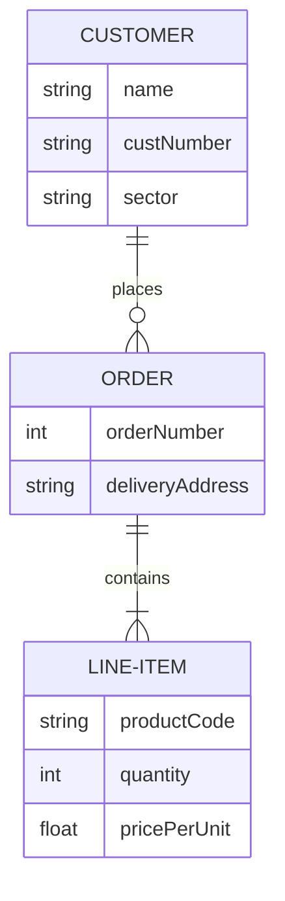
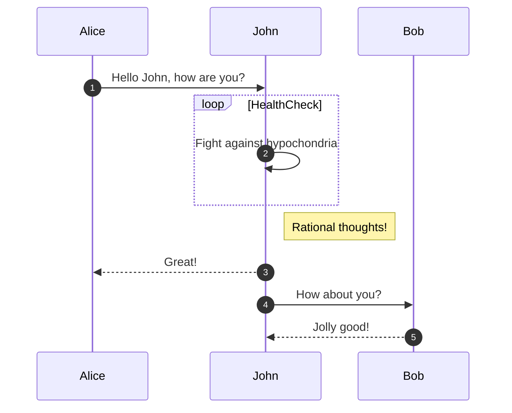

# State diagrams

```mermaid
    stateDiagram-v2
        state if_state <<choice>>
        [*] --> IsPositive
        IsPositive --> if_state
        if_state --> False: if n < 0
        if_state --> True : if n >= 0
```
---

```mermaid
    erDiagram
        CUSTOMER ||--o{ ORDER : places
        CUSTOMER {
            string name
            string custNumber
            string sector
        }
        ORDER ||--|{ LINE-ITEM : contains
        ORDER {
            int orderNumber
            string deliveryAddress
        }
        LINE-ITEM {
            string productCode
            int quantity
            float pricePerUnit
        }
```

```mermaid
    architecture-beta
        group api(cloud)[API]
    
        service db(database)[Database] in api
        service disk1(disk)[Storage] in api
        service disk2(disk)[Storage] in api
        service server(server)[Server] in api
    
        db:L -- R:server
        disk1:T -- B:server
        disk2:T -- B:db
```

```mermaid
    sequenceDiagram
        autonumber
        Alice->>John: Hello John, how are you?
        loop HealthCheck
            John->>John: Fight against hypochondria
        end
        Note right of John: Rational thoughts!
        John-->>Alice: Great!
        John->>Bob: How about you?
        Bob-->>John: Jolly good!

```
