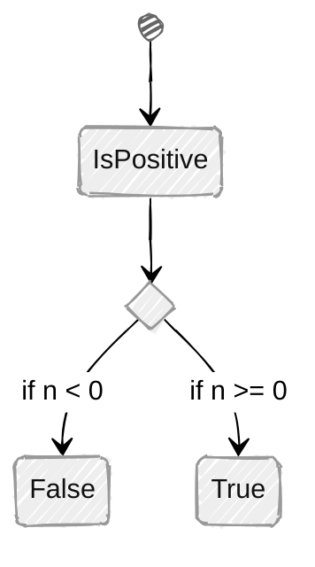
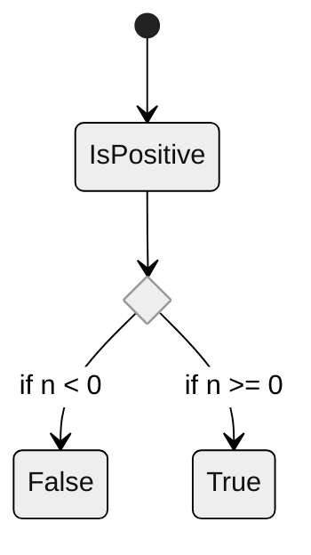
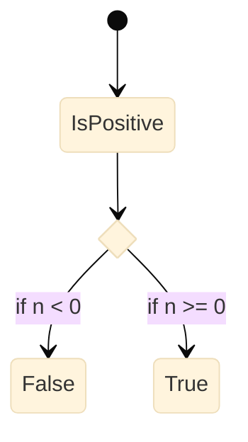
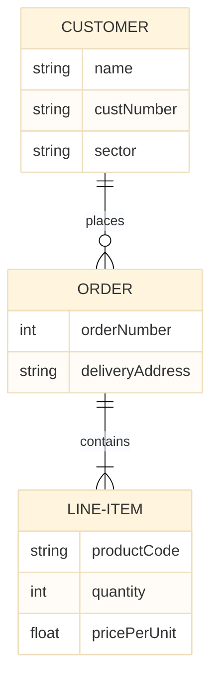
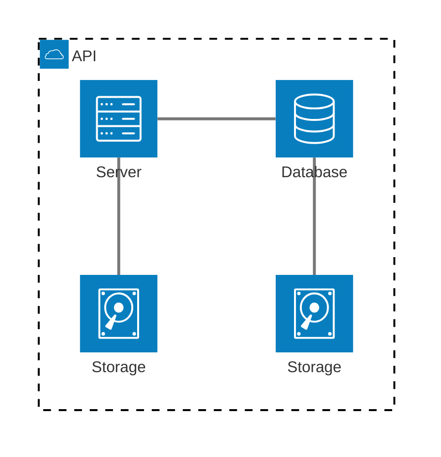
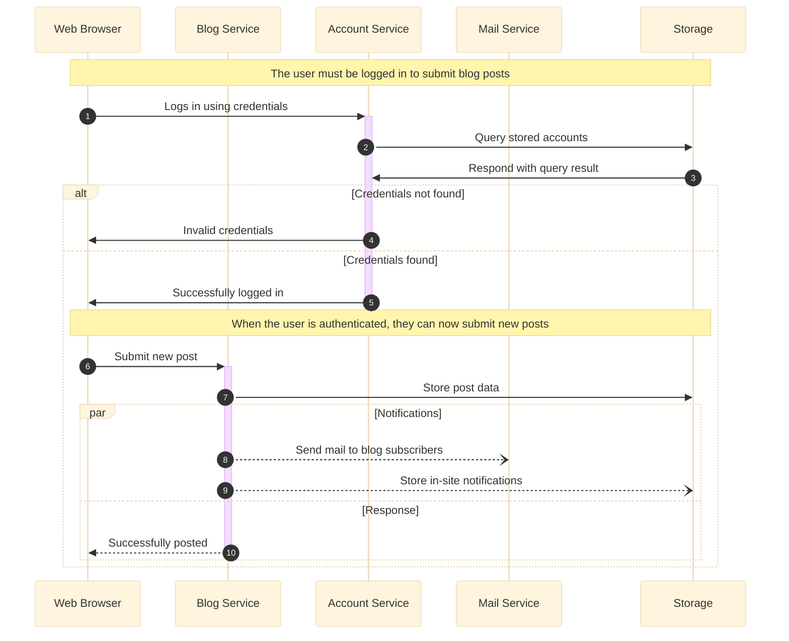
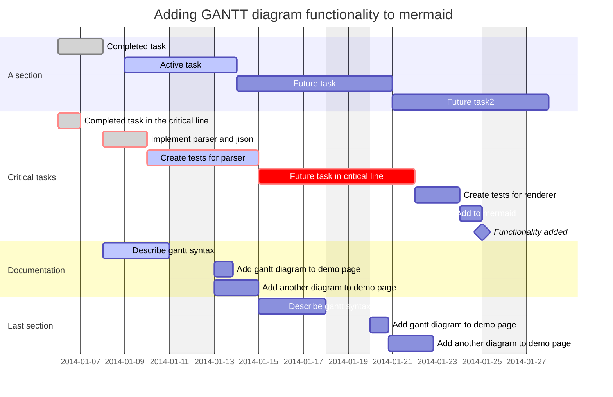

## State diagrams

```mermaid
---
config:
  look: handDrawn
  theme: neutral
---
    stateDiagram-v2
        state if_state <<choice>>
        [*] --> IsPositive
        IsPositive --> if_state
        if_state --> False: if n < 0
        if_state --> True : if n >= 0
```

```mermaid
---
config:
  layout: dagre
  look: classic
  theme: neutral
---
    stateDiagram-v2
        state if_state <<choice>>
        [*] --> IsPositive
        IsPositive --> if_state
        if_state --> False: if n < 0
        if_state --> True : if n >= 0
```

```mermaid
---
config:
  layout: dagre
  look: classic
  theme: base
---
    stateDiagram-v2
        state if_state <<choice>>
        [*] --> IsPositive
        IsPositive --> if_state
        if_state --> False: if n < 0
        if_state --> True : if n >= 0
```

## Entity Relationship Diagrams

```mermaid
---
config:
  layout: dagre
  look: classic
  theme: base
---
    erDiagram
        CUSTOMER ||--o{ ORDER : places
        CUSTOMER {
            string name
            string custNumber
            string sector
        }
        ORDER ||--|{ LINE-ITEM : contains
        ORDER {
            int orderNumber
            string deliveryAddress
        }
        LINE-ITEM {
            string productCode
            int quantity
            float pricePerUnit
        }
```
## Architecture Diagrams

```mermaid
---
config:
  layout: dagre
  look: classic
  theme: base
---
    architecture-beta
        group api(cloud)[API]
    
        service db(database)[Database] in api
        service disk1(disk)[Storage] in api
        service disk2(disk)[Storage] in api
        service server(server)[Server] in api
    
        db:L -- R:server
        disk1:T -- B:server
        disk2:T -- B:db
```

## Sequence Diagram

```mermaid
---
config:
  layout: dagre
  look: classic
  theme: base
---
    sequenceDiagram
        autonumber
        participant web as Web Browser
        participant blog as Blog Service
        participant account as Account Service
        participant mail as Mail Service
        participant db as Storage
    
        Note over web,db: The user must be logged in to submit blog posts
        web->>+account: Logs in using credentials
        account->>db: Query stored accounts
        db->>account: Respond with query result
    
        alt Credentials not found
            account->>web: Invalid credentials
        else Credentials found
            account->>-web: Successfully logged in
    
            Note over web,db: When the user is authenticated, they can now submit new posts
            web->>+blog: Submit new post
            blog->>db: Store post data
    
            par Notifications
                blog--)mail: Send mail to blog subscribers
                blog--)db: Store in-site notifications
            and Response
                blog-->>-web: Successfully posted
            end
        end
```

```mermaid
    gantt
        dateFormat  YYYY-MM-DD
        title       Adding GANTT diagram functionality to mermaid
        excludes    weekends
        %% (`excludes` accepts specific dates in YYYY-MM-DD format, days of the week ("sunday") or "weekends", but not the word "weekdays".)
    
        section A section
        Completed task            :done,    des1, 2014-01-06,2014-01-08
        Active task               :active,  des2, 2014-01-09, 3d
        Future task               :         des3, after des2, 5d
        Future task2              :         des4, after des3, 5d
    
        section Critical tasks
        Completed task in the critical line :crit, done, 2014-01-06,24h
        Implement parser and jison          :crit, done, after des1, 2d
        Create tests for parser             :crit, active, 3d
        Future task in critical line        :crit, 5d
        Create tests for renderer           :2d
        Add to mermaid                      :until isadded
        Functionality added                 :milestone, isadded, 2014-01-25, 0d
    
        section Documentation
        Describe gantt syntax               :active, a1, after des1, 3d
        Add gantt diagram to demo page      :after a1  , 20h
        Add another diagram to demo page    :doc1, after a1  , 48h
    
        section Last section
        Describe gantt syntax               :after doc1, 3d
        Add gantt diagram to demo page      :20h
        Add another diagram to demo page    :48h
```
