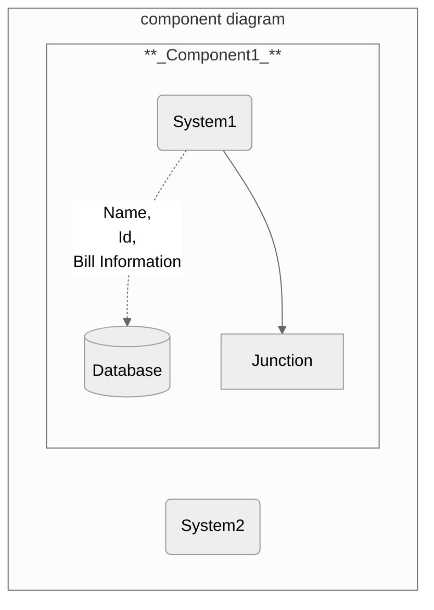
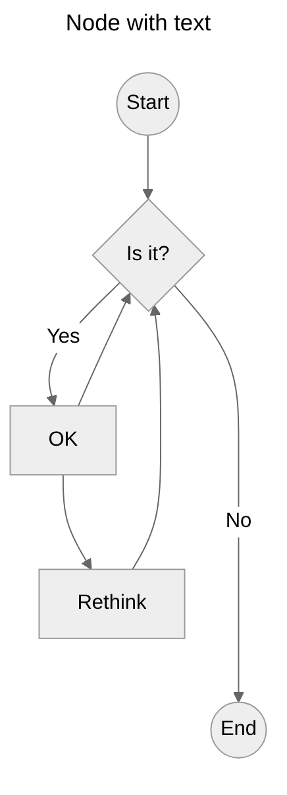
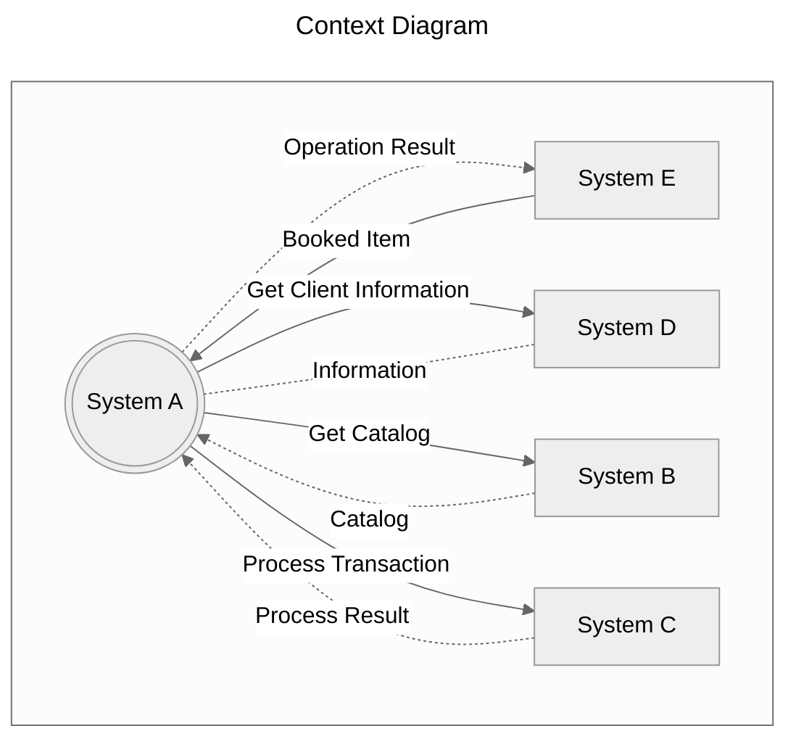
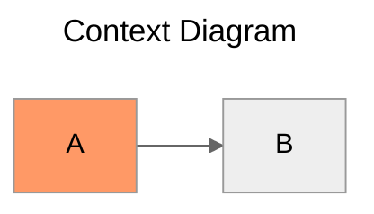

# Flow Chart 1

```mermaid
---
config:
  layout: dagre
  look: classic
  theme: neutral
---
flowchart TD
    subgraph component diagram
        id1(System1)
        id2[(Database)]
        id3(System2)

        subgraph **_Component1_**
            id1 -.
                Name, 
                Id,
                Bill Information
            .-> id2
            id1 --> Junction
        end
    end
```

```mermaid
---
title: Node with text
config:
  layout: dagre
  look: classic
  theme: neutral
---
flowchart TD    
    A((Start)) --> B{Is it?}
    B -->|Yes| C[OK]
    C --> D[Rethink]
    C --> B
    D --> B
    B ---->|No| E((End))
```

# Flow Chart 2

```mermaid
---
title: Context Diagram
config:
  layout: dagre
  look: classic
  theme: neutral
---
    flowchart TD
        %% define components
        A(((System A)))
        B[System B]
        C[System C]
        D[System D]
        E[System E]
        click B "https://github.com/Kuziomkin/diagrams/blob/main/mermaid_diagrams.md#flow-chart-1" "This is a tooltip for a link"

        subgraph " "
            direction LR
            %% define relationships
            E -- Booked Item --> A
            A -.Operation Result.-> E
            A --Get Client Information--> D
            D -.Information.- A
            A -- Get Catalog--> B
            B -. Catalog .-> A
            A --Process Transaction--> C
            C -.Process Result.->A
        end

```

```mermaid
---
title: Context Diagram
config:
  layout: dagre
  look: classic
  theme: neutral
---
flowchart LR
    A:::someclass --> B
    classDef someclass fill:#f96
```

