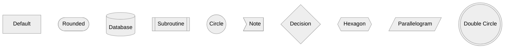
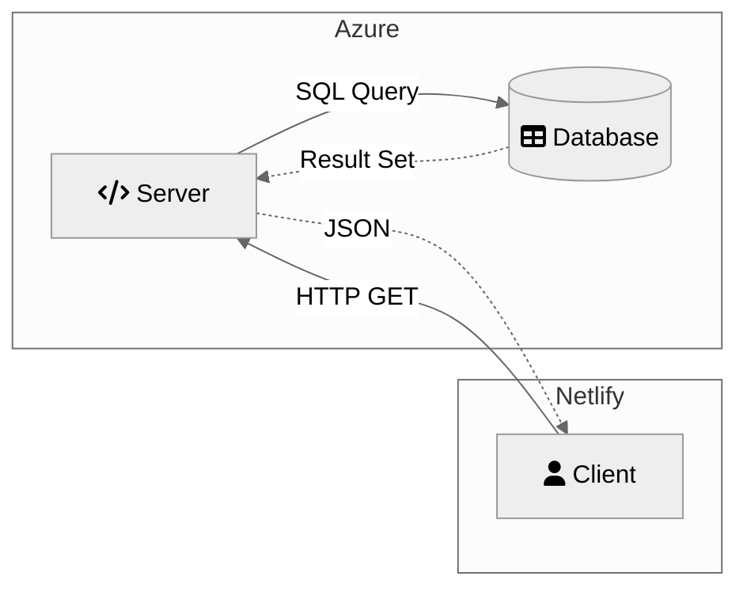
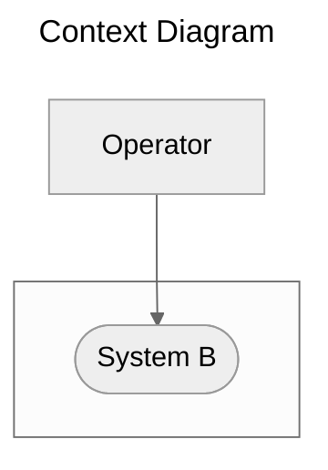

```mermaid
---
config:
  layout: dagre
  look: classic
  theme: neutral
---
flowchart TD 
    a[Default]
    b([Rounded])
    c[(Database)]
    d[[Subroutine]]
    e((Circle))
    f>Note]
    g{Decision}
    h{{Hexagon}}
    i[/Parallelogram/]
    j(((Double Circle)))
```
----

```mermaid
---
config:
  layout: dagre
  look: classic
  theme: neutral
---
flowchart LR
    subgraph Azure
        s[fa:fa-code Server]
        db[(fa:fa-table Database)]
    end
    subgraph Netlify
        c[fa:fa-user Client]
    end

    subgraph Netlify
    end
    subgraph Azure
        direction LR
    end
    
    c -- HTTP GET --> s
    s -- SQL Query --> db
    db -. Result Set .-> s
    s -. JSON .-> c
```

```mermaid
---
title: Context Diagram
config:
  layout: dagre
  look: classic
  theme: neutral
---
    flowchart TD
        %% define components
        O[Operator]

        subgraph " "
            direction LR
            B([System B])
        end

        %% define relationships
        O --> B

```

