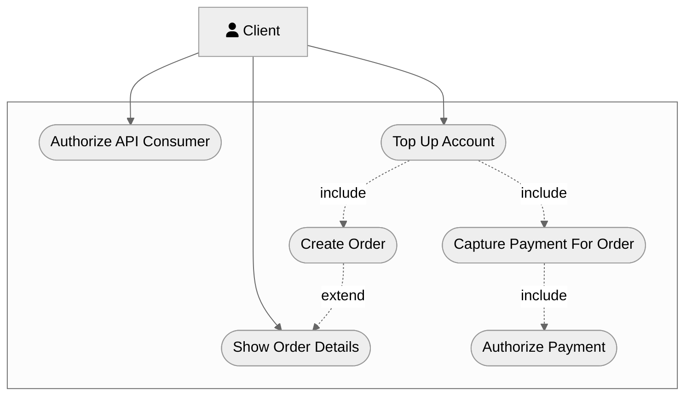
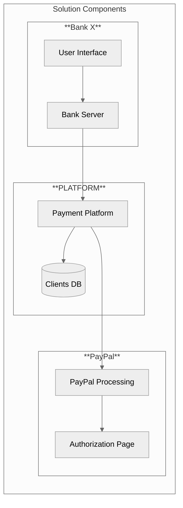
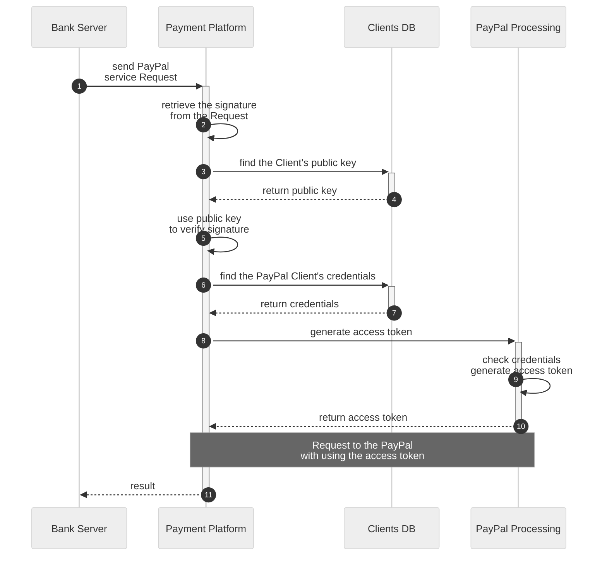

# Introduction
This document outlines the business, stakeholder, and solution requirements, as well as the assumptions and risks, for the account funding via PayPal feature.  
It is intended for product managers, developers, quality assurance specialists, and other stakeholders.  
The text contains many technical terms, which are defined in the Glossary section for further clarity. You can refer to the [Glossary](./glossary.md) for detailed explanations of these terms. 

# Objective and solution concept
This section describes business requirements, success metrics and assumptions.
## Context
Bank X, our customer, aims to increase monthly user activity. They have identified that some of their users utilize the PayPal system in both their business and personal lives. As a result, Bank X wants to offer the option for users to fund their bank accounts via PayPal without incurring any commission.
## Business opportunity
Platform can differentiate itself on the market by offering PayPal payment services as a separate product on its Payment Platform, accessible through a single API. This could give Platform a competitive advantage.
## Success metrics
Within six months of implementation, ten percent of Platform customers subscribed to the PayPal service through the Payment Platform.
## Assumptions
- Customers will be interested in using the PayPal service through the Payment Platform.
- The PayPal service will be easy for customers to use and understand.
- Customers will trust the PayPal service and feel confident using it to fund their bank accounts.
- The Payment Platform will be able to handle the additional traffic and workload generated by the PayPal service.
- The PayPal service will be available and reliable during the implementation period.
- The integration of the PayPal service into the Payment Platform will be successful and will not cause any disruptions or issues.
## Limitations
- The System must provide PayPal money transfer service via single Platform API. 

## User Classes and Characteristics
- End Users - these are the individuals who will be using the system to make payments or receive payments through PayPal.
- Bank - this is a business that accepts payments through PayPal.
- Security Specialists - these are the individuals responsible for ensuring the security of a bank's systems and processes.
- Payment Monitoring Specialists - these are the individuals responsible identifying and preventing fraudulent or unauthorized payment transactions, as well as analyzing and reviewing payment trends and patterns to identify potential risks or vulnerabilities.
- Developers - these are the individuals responsible for integrating PayPal into the system.
- Quality assurance specialists - these are the individuals responsible for testing the PayPal integration to ensure that it is working correctly.

# Project Scope

## Use Case Diagram

**Product Features**:

- The client can [authorize](https://github.com/Kuziomkin/diagrams/blob/main/specification.md#Authorize-API-Consumer) themselves
- The client can top up account via PayPal:
   - Create order
   - Capture payment for order
     - Authorize payment for order
 - The client can fetch order details
   - Show order details
  

## Conceptual Architecture

  Systems components:

- Bank
    - User Interface
    - Bank Server 
- Platform
    - Payment Platform
    - Clients DataBase
    - Platform API
- PayPal
    - PayPal Processing
    - Authorization Page
    - PayPal API

# System Features
## Use Cases
### Authorize API Consumer
Authorization is the process of determining whether a client or user has the permission to access a specific resource or perform a specific action through an API. This is typically done by verifying that the client or user has the necessary permissions or privileges to access the resource or perform the action.

**Diagram**
---

||Authorize API Consumer|
|---|---|
|**Participants**|Bank Server, Payment Platform, Clients DB, PayPal Processing|
|**Trigger**|Payment Platform accepts PayPal service request|
|**Main Flow**|01: Bank Server sends Request to Payment Platform   02: Payment Platform retrieves the signature from the Authorization header   03: Payment Platform queries Clients DataBase to find Client by using keyId from signature   04: Clients public key returns from Clients DataBase   05: Payment Platform uses the public key to verify the signature   06: Payment Platform queries Clients DataBase to get Clients credentials   07: Clients credentials returns from Clients DataBase   08: Payment Platform sends the request to PayPal Processing to generate access token   09: PayPal Processing checks credentials and generates access token   10: Access token returns to Payment Platform   ...   11: Bank Server gets operation result|    
|**Alternative and Negative Flows**| &mdash; Step 02 of the Main flow : There is no signature in the header => Bank Server gets HTTP 400 Bad Request   &mdash; Step 05 of the Main flow : Signature verification failed => Bank Server gets HTTP 401 Unauthorized|
|**Result**|Client successfully authorized|
