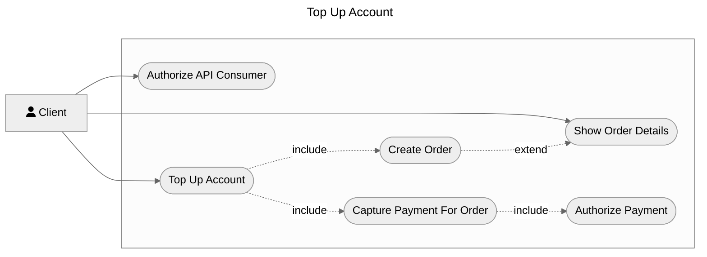

```mermaid
---
title: Top Up Account
config:
  layout: dagre
  look: classic
  theme: neutral
---
    flowchart LR
        %% define actors
        C[fa:fa-user Client]

        subgraph " "
            direction TB
            %% define features
            A([Authorize API Consumer])
            T([Top Up Account])
            S([Show Order Details])
            CP([Capture Payment For Order])
            CO([Create Order])
            AP([Authorize Payment])
        end

        %% define relationships
        C --> A
        C --> T
        C --> S
        T -.include.-> CP
        T -.include.-> CO
        CO -.extend.-> S
        CP -.include.-> AP
      
```